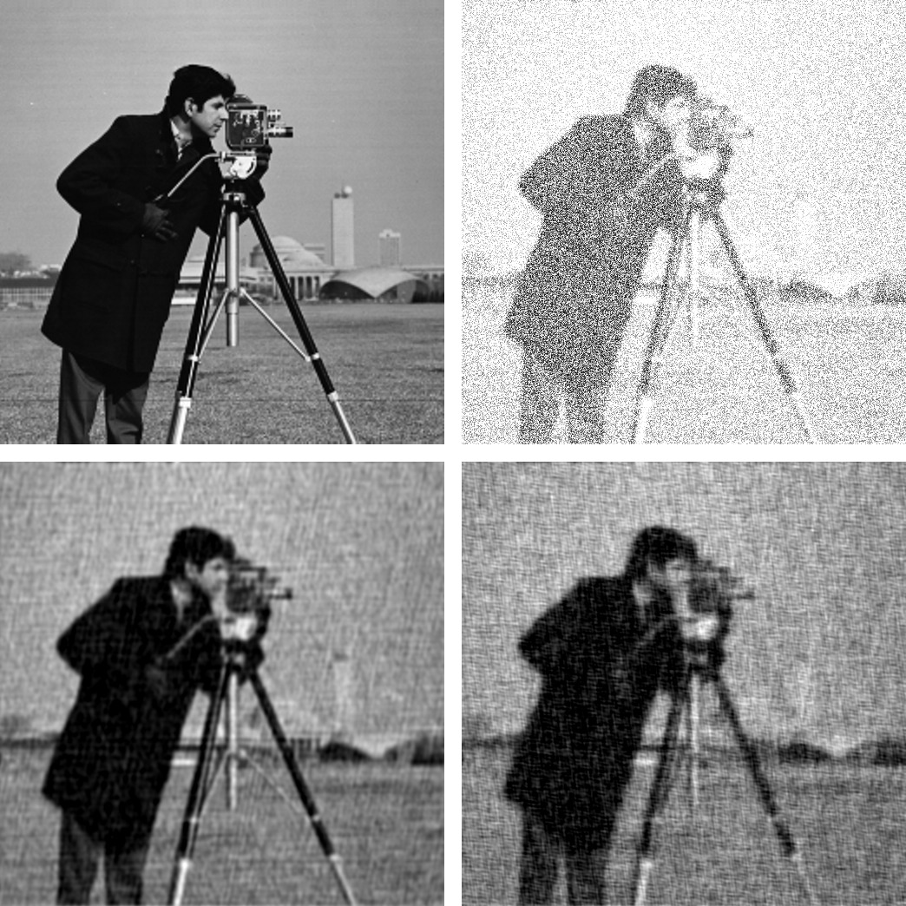

Deconvolution.jl
================

Introduction
------------

`This package <https://github.com/giordano/Deconvolution.jl>`__ provides a set
of functions to `deconvolve <https://en.wikipedia.org/wiki/Deconvolution>`__
digital signals, like images or time series.  This is written in `Julia
<http://julialang.org/>`__, a modern high-level, high-performance dynamic
programming language designed for technical computing.

Installation
------------

``Deconvolution.jl`` is available for Julia 0.4 and later versions, and can be
installed with `Julia built-in package manager
<http://docs.julialang.org/en/stable/manual/packages/>`__.  In a Julia session
run the command

.. code-block:: julia

    julia> Pkg.update()
    julia> Pkg.add("Deconvolution")

Usage
-----

Currently ``Deconvolution.jl`` provides only one methd, but others will come in
the future.

``wiener``
~~~~~~~~~~

.. code:: julia

    wiener(input, signal, noise[, blurring])

The `Wiener deconvolution
<https://en.wikipedia.org/wiki/Wiener_deconvolution>`__ attempts at reducing the
noise in a digital signal by suppressing frequencies with low `signal-to-noise
ratio <https://en.wikipedia.org/wiki/Signal-to-noise_ratio>`__.  The signal is
assumed to be degraded by additive noise and a shift-invariant blurring
function.

Theoretically, the Wiener deconvolution method requires the knowledge of the
original signal, of the blurring function, and the noise.  However, these
conditions are difficult to met (and, of course, if you know the original signal
you do not need to perform a deconvolution in order to recover the signal
itself), but a strenght of the Wiener deconvolution is that it works in the
frequency domain, so you only need to know with good precision the power spectra
of the signal and the noise.  In addition, most signals of the same class have
fairly similar power spectra and the Wiener filter is insensitive to small
variations in the original signal power spectrum.  For these reasons, it is
possible to estimate the original signal power spectrum using a representative
of the class of signals being filtered.

For a short review of the Wiener deconvolution method see
https://github.com/giordano/wiener-filter/releases/download/final/wiener.pdf and
references therein.

The ``wiener`` function can be used to apply the Wiener deconvolution method to
a digital signal. The arguments are:

- ``input``: the digital signal
- ``signal``: the original signal (or a signal with a likely similar power
  spectrum)
- ``noise``: the noise of the signal (or a noise with a likely similar power
  spectrum)
- ``blurring`` (optional argument): the blurring function

All arguments must be arrays, all with the same size, and all of them in the
time/space domain (they will be converted to the frequency domain internally
using ``fft`` function).  Argument ``noise`` can be also a real number, in which
case a constant noise with that value will be assumed (this is a good
approximation in the case of `white noise
<https://en.wikipedia.org/wiki/White_noise>`__).

Examples
--------

Wiener deconvolution
~~~~~~~~~~~~~~~~~~~~

Here is an example of use of ``wiener`` function to perform the Wiener
deconvolution of an image, degraded with a blurring function and an additive
noise.

.. code-block:: julia

    using Images, TestImages, Deconvolution, ImageView

    # Open the test image
    img = float(data(testimage("cameraman")))'
    # Create the blurring kernel in frequency domain
    x = hcat(ntuple(x -> collect((1:512) - 257), 512)...)
    k = 0.001
    blurring_ft = exp(-k*(x .^ 2 + x' .^ 2).^(5//6))
    # Create additive noise
    noise = rand(size(img))
    # Fourier transform of the blurred image, with additive noise
    blurred_img_ft = fftshift(blurring_ft) .* fft(img) + fft(noise)
    # Get the blurred image from its Fourier transform
    blurred_img = real(ifft(blurred_img_ft))
    # Get the blurring kernel in the space domain
    blurring = ifft(fftshift(blurring_ft))
    # Polish the image with Deconvolution deconvolution
    polished = wiener(blurred_img, img, noise, blurring)

    # Wiener deconvolution works also when you don't have the real image and noise,
    # that is the most common and useful case.  This happens because the Wiener
    # filter only cares about the power spectrum of the signal and the noise, so you
    # don't need to have the exact signal and noise but something with a similar
    # power spectrum.
    img2 = float(data(testimage("livingroom"))) # Load another image
    noise2 = rand(size(img)) # Create another additive noise
    # Polish the image with Deconvolution deconvolution
    polished2 = wiener(blurred_img, img2, noise2, blurring)

    # Compare...
    view(img) # ...the original image
    view(blurred_img) # ...the blurred image
    view(polished) # ...the polished image
    view(polished2) # ...the second polished image

Development
-----------

The package is developed at https://github.com/giordano/Deconvolution.jl.  There
you can submit bug reports, propose new deconvolution methods with pull
requests, and make suggestions.

History
~~~~~~~

The ChangeLog of the package is available in `NEWS.md
<https://github.com/giordano/Deconvolution.jl/blob/master/NEWS.md>`__ file in
top directory.

License
-------

The ``Deconvolution.jl`` package is licensed under the MIT "Expat" License.  The
original author is Mosè Giordano.
