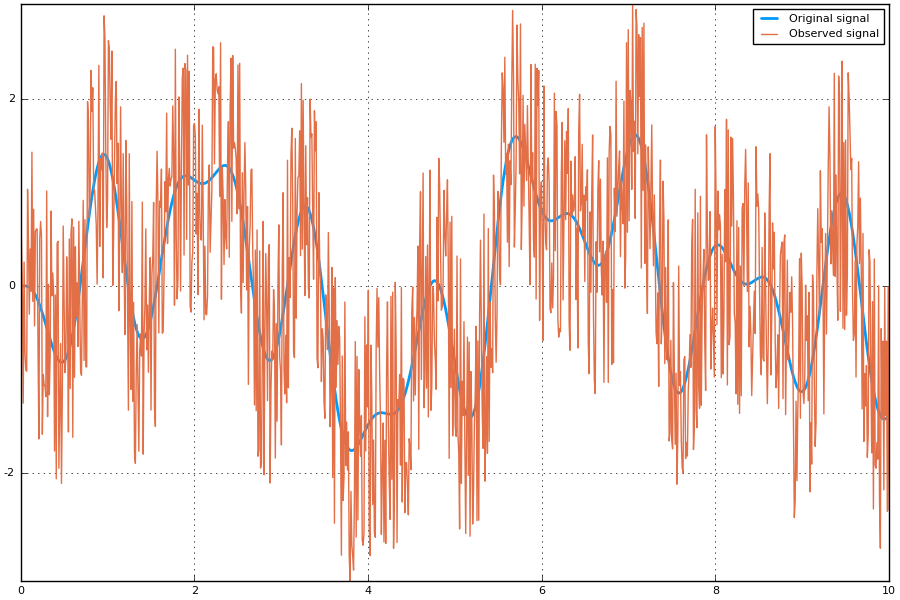
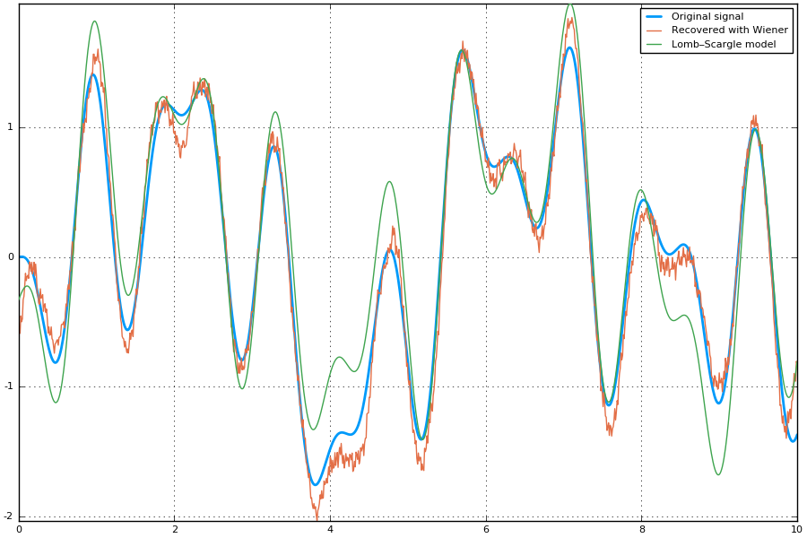
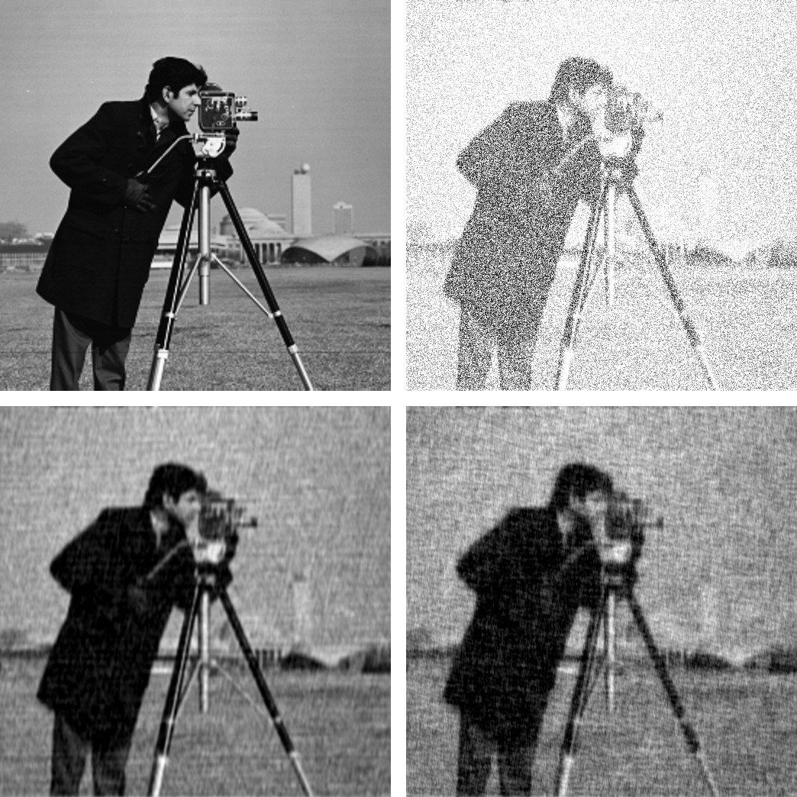
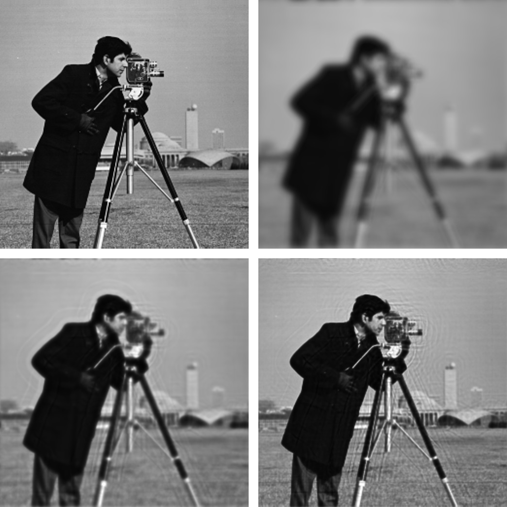

# Deconvolution.jl

---

## Introduction

[Deconvolution.jl](https://github.com/JuliaDSP/Deconvolution.jl)
provides a set of functions to
[deconvolve](https://en.wikipedia.org/wiki/Deconvolution) digital
signals, like images or time series. This is written in
[Julia](http://julialang.org/), a modern high-level, high-performance
dynamic programming language designed for technical computing.

## Installation

The latest version of `Deconvolution.jl` is available for Julia 1.0 and
later versions, and can be installed with [Julia built-in package
manager](https://julialang.github.io/Pkg.jl/stable/). In a Julia
session, after entering the package manager mode with \], run the
command

``` {.sourceCode .julia}
pkg> add Deconvolution
```

Older versions are also available for Julia 0.4-0.7.

## Usage

Currently `Deconvolution.jl` provides only two methods, but others will
hopefully come in the future.

### `wiener` function

The [Wiener
deconvolution](https://en.wikipedia.org/wiki/Wiener_deconvolution)
attempts at reducing the noise in a digital signal by suppressing
frequencies with low [signal-to-noise
ratio](https://en.wikipedia.org/wiki/Signal-to-noise_ratio). The signal
is assumed to be degraded by additive noise and a shift-invariant
blurring function.

Theoretically, the Wiener deconvolution method requires the knowledge of
the original signal, the blurring function, and the noise. However,
these conditions are difficult to met (and, of course, if you know the
original signal you do not need to perform a deconvolution in order to
recover the signal itself), but a strength of the Wiener deconvolution
is that it works in the frequency domain, so you only need to know with
good precision the power spectra of the signal and the noise. In
addition, most signals of the same class have fairly similar power
spectra and the Wiener filter is insensitive to small variations in the
original signal power spectrum. For these reasons, it is possible to
estimate the original signal power spectrum using a representative of
the class of signals being filtered.

For a short review of the Wiener deconvolution method see
<http://www.dmf.unisalento.it/~giordano/allow_listing/wiener.pdf> and
references therein.

The wiener function can be used to apply the Wiener deconvolution method
to a digital signal. The arguments are:

-   `input`: the digital signal
-   `signal`: the original signal (or a signal with a likely similar
    power spectrum)
-   `noise`: the noise of the signal (or a noise with a likely similar
    power spectrum)
-   `blurring` (optional argument): the blurring kernel

All arguments must be arrays, all with the same size, and all of them in
the time/space domain (they will be converted to the frequency domain
internally using `fft` function). Argument `noise` can be also a real
number, in which case a constant noise with that value will be assumed
(this is a good approximation in the case of [white
noise](https://en.wikipedia.org/wiki/White_noise)).

### `lucy` function

The [Richardson-Lucy deconvolution](https://en.wikipedia.org/wiki/Richardson-Lucy_deconvolution)
is an iterative method based on Bayesian inference for restoration of signal
that is convolved with a point spread function.

The `lucy` function can be used to apply the Richardson-Lucy deconvolution
method to a digital signal. The arguments are:

-   `observed`: the digital signal
-   `psf`: the point spread function
-   `iterations` (optional argument): the number of iterations

First two arguments must be arrays, all with the same size, and all of them
in the time/space domain (they will be converted to the frequency domain
internally using `fft` function). Argument `iterations` is an integer number.
The more iterations is specified the better result should be if the solution
converges and it is going to converge if PSF is estimated well.

## Examples

### Wiener deconvolution

#### Noisy time series

This is an example of application of the Wiener deconvolution to a time
series.

We first construct the noisy signal:

``` {.sourceCode .julia}
using LombScargle, Deconvolution, Plots
t = linspace(0, 10, 1000) # observation times
x = sinpi(t) .* cos.(5t) .- 1.5cospi.(t) .* sin.(2t) # the original signal
n = rand(length(x)) # noise to be added
y = x + 3(n - mean(n)) # observed noisy signal
```

In order to perform the Wiener deconvolution, we need a signal that has
a power spectrum similar to that of the original signal. We can use the
[Lomb–Scargle
periodogram](https://en.wikipedia.org/wiki/Least-squares_spectral_analysis)
to find out the dominant frequencies in the observed signal, as
implemented in the the Julia package
[LombScargle.jl](https://github.com/giordano/LombScargle.jl).

``` {.sourceCode .julia}
# Lomb-Scargle periodogram
p = lombscargle(t, y, maximum_frequency=2, samples_per_peak=10)
plot(freqpower(p)...)
```

After plotting the periodogram you notice that it has three peaks, one
in each of the following intervals: $[0, 0.5]$, $[0.5, 1]$, $[1,
1.5]$. Use the `LombScargle.model` function to create the best-fitting
Lomb–Scargle model at the three best frequencies, that can be found with
the `findmaxfreq` function (see the manual at
<http://lombscarglejl.readthedocs.io/> for more details):

``` {.sourceCode .julia}
m1 = LombScargle.model(t, y, findmaxfreq(p, [0, 0.5])[1]) # first model
m2 = LombScargle.model(t, y, findmaxfreq(p, [0.5, 1])[1]) # second model
m3 = LombScargle.model(t, y, findmaxfreq(p, [1, 1.5])[1]) # third model
```

Once you have these three frequencies, you can deconvolve `y` by feeding
wiener with a simple signal that is the sum of these three models:

``` {.sourceCode .julia}
signal = m1 + m2 + m3 # signal for `wiener`
noise = rand(length(y)) # noise for `wiener`
polished = wiener(y, signal, noise)
# Compare...
plot(t, x, size=(900, 600), label="Original signal", linewidth=2)
plot!(t, y, label="Observed signal") # ...original and observed signal
plot(t, x, size=(900, 600), label="Original signal", linewidth=2)
plot!(t, polished, label="Recovered with Wiener") # ...original and recovered signal
plot!(t, signal, label="Lomb–Scargle model") #...and best fitting Lomb–Scargle model
```





Note that the signal recovered with the Wiener deconvolution is
generally a good improvement with respect to the best-fitting
Lomb–Scargle model obtained using a few frequencies.

With real-world data the Lomb–Scargle periodogram may not work as good
as in this toy-example, but we showed a possible strategy to create a
suitable signal to use with wiener function.

#### Blurred image

Here is an example of use of wiener function to perform the Wiener
deconvolution of an image, degraded with a blurring function and an
additive noise.

``` {.sourceCode .julia}
using Images, TestImages, Deconvolution, ImageView

# Open the test image
img = float(data(testimage("cameraman")))'
# Create the blurring kernel in frequency domain
x = hcat(ntuple(x -> collect((1:512) - 257), 512)...)
k = 0.001
blurring_ft = exp.(-k*(x .^ 2 + x' .^ 2).^(5//6))
# Create additive noise
noise = rand(size(img))
# Fourier transform of the blurred image, with additive noise
blurred_img_ft = fftshift(blurring_ft) .* fft(img) + fft(noise)
# Get the blurred image from its Fourier transform
blurred_img = real(ifft(blurred_img_ft))
# Get the blurring kernel in the space domain
blurring = ifft(fftshift(blurring_ft))
# Polish the image with Deconvolution deconvolution
polished = wiener(blurred_img, img, noise, blurring)

# Wiener deconvolution works also when you don't have the real image and noise,
# that is the most common and useful case.  This happens because the Wiener
# filter only cares about the power spectrum of the signal and the noise, so you
# don't need to have the exact signal and noise but something with a similar
# power spectrum.
img2 = float(data(testimage("livingroom"))) # Load another image
noise2 = rand(size(img)) # Create another additive noise
# Polish the image with Deconvolution deconvolution
polished2 = wiener(blurred_img, img2, noise2, blurring)

# Compare...
view(img) # ...the original image
view(blurred_img) # ...the blurred image
view(polished) # ...the polished image
view(polished2) # ...the second polished image
```



### Richardson-Lucy deconvolution

#### Blurred image

Here is an example of use of `lucy` function to perform the Richardson-Lucy
deconvolution of an image convolved with point spread function that models lens
aberration.

``` {.sourceCode .julia}
    using Images, TestImages, Deconvolution, FFTW, ZernikePolynomials, ImageView

    img = channelview(testimage("cameraman"))

    # model of lens aberration
    blurring = evaluateZernike(LinRange(-16,16,512), [12, 4, 0], [1.0, -1.0, 2.0], index=:OSA)
    blurring = fftshift(blurring)
    blurring = blurring ./ sum(blurring)

    blurred_img = fft(img) .* fft(blurring) |> ifft |> real

    @time restored_img_200 = lucy(blurred_img, blurring, iterations=200)
    @time restored_img_2000 = lucy(blurred_img, blurring, iterations=2000)

    imshow(img)
    imshow(blurred_img)
    imshow(restored_img_200)
    imshow(restored_img_2000)
```



## Development

The package is developed at
<https://github.com/JuliaDSP/Deconvolution.jl>. There you can submit bug
reports, propose new deconvolution methods with pull requests, and make
suggestions. If you would like to take over maintainership of the
package in order to further improve it, please open an issue.

### History

The ChangeLog of the package is available in
[NEWS.md](https://github.com/JuliaDSP/Deconvolution.jl/blob/master/NEWS.md)
file in top directory.

## License

The `Deconvolution.jl` package is licensed under the MIT "Expat"
License. The original author is Mosè Giordano.
